  <picture>
    <source media="(prefers-color-scheme: dark)" srcset="assets/dark.svg">
    <source media="(prefers-color-scheme: light)" srcset="assets/light.svg">
    
  </picture>

<!-- Visitor Counter -->

  

---

## 🧑‍💻 About Me

> *"Jack of all trades, master of none."*

- 🤖 **AI/ML Engineer • Full Stack Developer**
- 🎓 B.Tech CSE (AI & ML) — Newton School of Technology × ADYPU
- 📍 Pune, India
- 🔭 Currently building, learning, and shipping
- 🌱 Open to internships and open-source contributions

---

## 🛠️ Tech Stack

<table>
<tr>
<td align="center" width="96">

 Python
</td>
<td align="center" width="96">

 JavaScript
</td>
<td align="center" width="96">

 React
</td>
<td align="center" width="96">

 Next.js
</td>
<td align="center" width="96">

 Tailwind
</td>
<td align="center" width="96">

 FastAPI
</td>
</tr>
<tr>
<td align="center" width="96">

 PostgreSQL
</td>
<td align="center" width="96">

 Docker
</td>
<td align="center" width="96">

 Git
</td>
<td align="center" width="96">

 Linux
</td>
<td align="center" width="96">

 Bash
</td>
<td align="center" width="96">

 HTML5
</td>
</tr>
</table>

---

## 🚀 Featured Projects

<table>
<tr>
<td width="50%">

### 🎬 Omnitrix OS
> A futuristic OS-inspired interface with cyberpunk aesthetics

  

 

 

</td>
<td width="50%">

### 🎥 CineVault
> Your personal movie collection manager with AI recommendations

  

 

 

</td>
</tr>
<tr>
<td width="50%">

### 🚀 Deploy Forge
> One-click deployment toolkit for modern web apps

  

 

 

</td>
<td width="50%">

### 💰 Udhaar Ledger
> Digital ledger for tracking debts and payments

  

 

 

</td>
</tr>
</table>

---

## 📊 GitHub Stats

  
  

---

## 🏆 Top Languages

  

---

## 🐍 Contribution Snake

  

---

## 📈 Activity Graph

  

---

## 💡 Coding Quote

> *"First, solve the problem. Then, write the code."*
> — **John Johnson**

---

## 😂 Random Dev Joke

> **Why do programmers prefer dark mode?**
>
> Because light attracts bugs! 🐛

---

## 📬 Connect With Me

  
  
  

---

⭐ **Star this repo if you found it helpful!**

*"Building · Learning · Shipping"*

