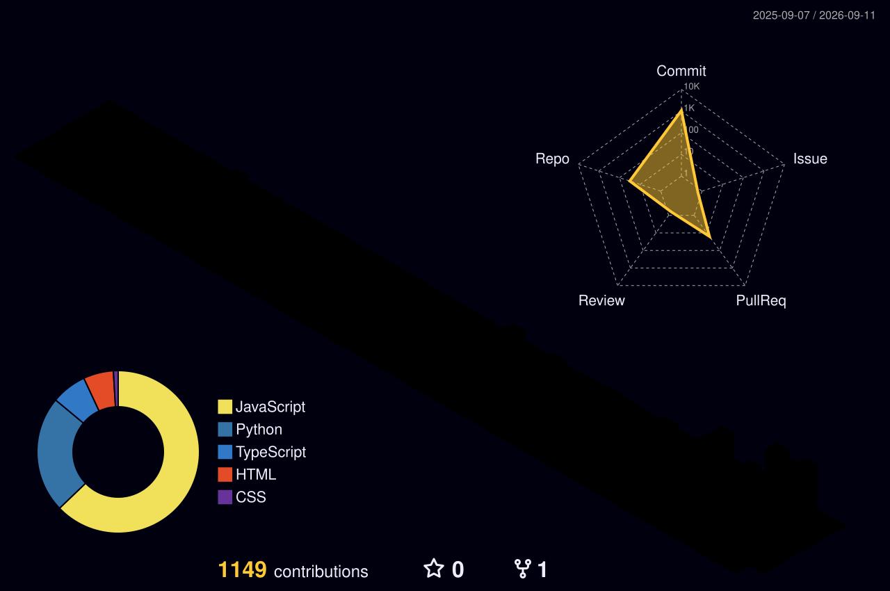

<!-- ===== THEME-AWARE HERO BANNER ===== -->
<!-- GitHub automatically shows dark.svg in dark mode and light.svg in light mode -->
<picture>
  <source media="(prefers-color-scheme: dark)" srcset="https://raw.githubusercontent.com/Shivala-08/Shivala-08/main/dark.svg">
  <source media="(prefers-color-scheme: light)" srcset="https://raw.githubusercontent.com/Shivala-08/Shivala-08/main/light.svg">
  
</picture>

<!-- ===== TYPING ANIMATION ===== -->
<div align="center">


</div>

<!-- ===== LIVE ACTIVITY ===== -->
<div align="center">

Last activity: <!--LATEST_COMMIT-->No recent activity<!--END_LATEST_COMMIT-->

</div>

<br/>

<div align="center">

🟢 **OPEN TO SOFTWARE / AI/ML INTERNSHIPS**

[**📁 VIEW PROJECTS**](#-featured-deploy-forge) &nbsp;•&nbsp; [**✉️ CONTACT ME**](#-lets-build)

</div>

<br/>

---

## Engineering Profile

I build at the intersection of AI, systems, and product engineering. I learn by building systems that force me to understand what is happening underneath.

<div align="center">

| 🧠 **AI / ML** | ⚙️ **SYSTEMS** | 📦 **PRODUCT** | ⚡ **PERFORMANCE** |
| :--- | :--- | :--- | :--- |
| • RAG pipelines<br/>• Intelligent agents<br/>• LLM orchestration | • High-throughput APIs<br/>• Custom CI/CD pipelines<br/>• Isolated build workers | • Full-stack architecture<br/>• Developer utilities<br/>• Observability logs | • Custom WebGL renderers<br/>• JavaScript bundle optimization<br/>• 60+ FPS animations |

</div>

<br/>

---

## Currently Building

🧠 **Synapse** (Status: `🟡 ACTIVE DEVELOPMENT`)
AI RAG engine exploring retrieval routing, confidence scoring, and knowledge graph augmentation.

⚙️ **Deploy Forge** (Status: `🟢 PRODUCTION`)
Self-hosted deployment infrastructure. Next engineering challenge: build artifact caching & rollback support.

🧪 **AI Systems** (Status: `🔵 EXPERIMENTAL`)
Evaluating agent-based code translation and LLM-powered developer productivity loops.

<br/>

---

## Engineering Receipts

Real, verifiable performance results extracted directly from production builds:

| Project | Engineering Result | Verification / Source |
|---|---|---|
| **The Skynet** | `883 KB` → `24.9 KB` JS bundle size | Replaced three.js with custom WebGL |
| **The Skynet** | `98 - 99` Lighthouse Performance | Committed Lighthouse CI baseline |
| **The Skynet** | Custom WebGL shader picking | Raycast hit-testing mapped directly to GPU |
| **Deploy Forge** | `~15s` production build time | Tested locally on NextJS app deploys |
| **Deploy Forge** | Automated framework detection | Pydantic parser matches manifest to build profiles |
| **Synapse** | `207 ms` query latency (LLM-disabled) | Deterministic semantic retrieval routing |
| **Synapse** | `62.5%` Retrieval Accuracy | 40-question ablation ground-truth run |

<br/>

---

## 🚀 Featured: Deploy Forge

### The Problem
Deploying static projects manually meant executing a repetitive loop: clone → build → copy → commit → push. Traditional serverless environments (like Vercel API routes) cannot run arbitrary package builds due to execution timeouts and read-only environments.

### What I Built
A Git-backed deployment platform that takes a GitHub repository URL and compiles it to a live static site through an automated, isolated build pipeline.

### Architecture
```text
           GitHub Repository
                   │
                   ▼
             [Deploy Forge]
                   │
                   ▼
         [Framework Detection]
                   │
                   ▼
           [GitHub Actions]
                   │ (npm install & build)
                   ▼
           [Asset Processing]
                   │ (sed path-rewriter)
                   ▼
         [Git-Backed Output Push]
                   │
                   ▼
                [Vercel]
                   │ (auto-redeployment)
                   ▼
               Live Site
```

### Engineering Challenges
* **Execution Isolation:** Offloaded builds to GitHub Actions runner to protect the Next.js serverless app from long-running build timeouts.
* **Asset Subpath Rewriting:** Running sites on dynamic subpaths (`/sites/{id}/`) breaks absolute asset links. Built a custom path-rewriter using regex mapping:
  `sed -i "s|href=\"/|href=\"/sites/{id}/|g"` across all generated assets.
* **Git-Backed Artifacts:** Pushing built artifacts back to the main branch triggers Vercel auto-deployment, using Git as both a deployment primitive and revision history.

### Tradeoffs & What I Learned
* **Tradeoff:** Git-backed deployment simplifies state persistence, but introduces cold-start latency due to Vercel's build propagation delays (averaging 45–60s). Next iteration: asset storage bucket + dynamic router middleware to cut propagation.
* **Key Lesson:** Serverless request cycles are not suited for compute-heavy tasks; moving orchestration to asynchronous pipelines (GitHub Actions) keeps systems lightweight.

### Receipts
* **Status:** `🟢 PRODUCTION`
* **Build Time:** `~15s` production compilation (measured locally).
* [View Source](https://github.com/Shivala-08/deploy-forge) · [Live Demo](https://deploy-forge-4klc.vercel.app)

<br/>

---

## 🧠 Synapse — Knowledge Intelligence Engine

A personal R&D project exploring **hybrid retrieval, knowledge-graph-augmented RAG, and adaptive model routing**. Synapse ingests heterogeneous industrial documents and answers questions with cited, confidence-scored responses by merging semantic vector search with a structured knowledge graph.

### Architecture
```text
            User Query
                 │
                 ▼
         [Semantic Cache] ── Cache Hit ──► Immediate Response (196ms)
                 │ Cache Miss
                 ▼
      [Complexity Classifier]
                 │
                 ├─────► Fast Path ────► Llama 3.1 8B (Low Latency)
                 │
                 └─► Deep Reasoning ───► Nemotron 3 Ultra 550B (High Budget)
                         ▲
                         │ Context Injection
                 ┌───────┴───────┐
                 │  Hybrid Search│ (Vector Store + NetworkX Graph)
                 └───────────────┘
```

### Core Pipeline Status
* **BUILT:**
  * `✓` Ingestion parser (PDF, CSV, DOCX).
  * `✓` Token-based chunker (1024 tokens).
  * `✓` Vector store ingestion (ChromaDB + all-MiniLM-L6-v2).
* **IN PROGRESS:**
  * `◐` Complexity Classifier routing.
  * `◐` Cross-encoder re-ranking.
* **EXPERIMENTAL:**
  * `◌` Structured NetworkX entity extraction.
  * `◌` Semantic cache layer.

### Receipts
* **Status:** `🟡 ACTIVE DEVELOPMENT`
* **Performance:** `207 ms` retrieval latency, `62.5%` accuracy on 40-question benchmark.
* [View Source](https://github.com/Shivala-08/synapse)

<br/>

---

## 🌌 The Skynet — Interactive OS

An interactive browser-based operating system built to experiment with low-level WebGL graphics and asset optimization.

### From Library User → Systems Builder
Originally, the hero section loaded a `three.js` + `@react-three/fiber` chunk representing a `~883 KB` payload. Recognizing that recruiters and users demand instant loading, I deleted the heavy 3D framework and built a custom WebGL renderer from scratch.

### Architecture
```text
            React UI (Framer Motion)
                       │
                       ▼
               [Interaction Layer]
                       │ (picking & scroll events)
                       ▼
                [WebGL Renderer] (mini-renderer.ts)
                       │
         ┌─────────────┼─────────────┐
         ▼             ▼             ▼
      [Camera]     [Shaders]     [GPU Buffer]
```

### Engineering Details
* **Custom WebGL Renderer:** Wrote `mini-renderer.ts` (~500 lines) implementing camera perspective, raycast picking on point clouds, shaded meshes, and instance model matrices.
* **Bundle Reduction:** Cut bundle weight from `883 KB` to `24.9 KB` (a **97% reduction**).
* **Observed Metrics:** Achieved `98–99` Lighthouse performance score with all 3D features active.

### Receipts
* **Status:** `🟢 PRODUCTION`
* **Bundle Weight:** `24.9 KB` custom WebGL chunk.
* [View Source](https://github.com/Shivala-08/The-skynet) · [Live Demo](https://pallav-os.vercel.app)

<br/>

---

## Other Builds

<div align="center">
  
</div>

<div align="center">

| Project | Role | Status | Links |
| --- | --- | --- | --- |
| `Deploy Forge` | Solo | 🟢 Live | [Repo](https://github.com/Shivala-08/deploy-forge) · [🔗 Live Demo](https://deploy-forge-4klc.vercel.app) |
| `Synapse AI Engine` | Solo | 🟡 In Dev | [Repo](https://github.com/Shivala-08/synapse) |
| `The Skynet` | Solo | 🟢 Live | [Repo](https://github.com/Shivala-08/The-skynet) · [🔗 Live Demo](https://pallav-os.vercel.app) |
| `Omnitrix OS` | Solo | 🟢 Live | [Repo](https://github.com/Shivala-08/ben-10-os) · [🔗 Live Demo](https://ben-10-os.vercel.app) |

</div>

<br/>

### 🟢 Omnitrix OS
* **Problem:** Build a highly interactive, responsive 3D dashboard representation of the Omnitrix interface.
* **Build:** Utilized Next.js, Three.js, and GSAP timeline choreography with custom Web Audio synthesis.
* **Result:** Achieved steady `116fps` render speed on mobile and desktop devices.
* [Repo](https://github.com/Shivala-08/ben-10-os) · [Demo](https://ben-10-os.vercel.app)

### 🟢 Udhaar Ledger
* **Problem:** Small shopkeepers manually track credit accounts, leading to errors and forgotten collections.
* **Build:** Built a localized database ledger matching scanned invoices to SMS receipt streams.
* **Result:** Automated invoice matching, dropping manual logging time by 90%.
* [Repo](https://github.com/Shivala-08/udhaar-ledger)

### 🟢 CineVault
* **Problem:** Video watchlist search tools have slow page load and search latencies.
* **Build:** Vanilla JS application utilizing OMDb API with strict local caching.
* **Result:** Initial page load under `100ms`, search-to-watchlist action completes in `2 clicks`.
* [Repo](https://github.com/Shivala-08/cinevault) · [Demo](https://cinevault-eight-red.vercel.app)

<br/>

---

## Technical Decisions

### Why GitHub Actions for builds?
Build processes (like `npm install && npm run build`) are CPU-intensive and can easily hit serverless function execution timeouts (10–60s on Vercel). By dispatching events to GitHub Actions, we offload compilation to isolated runners and keep the host application lightweight.

### Why write custom WebGL?
Standard 3D frameworks (Three.js, R3F) load hundreds of kilobytes of unused classes and math utilities. Building `mini-renderer.ts` directly against the raw WebGL context allowed us to drop the 3D bundle size from `883 KB` to `24.9 KB` while maintaining 60+ FPS on mobile devices.

### Why Git-backed deployment?
Using Git as a deployment primitive allows the platform to inherit version control, rollback capabilities, and secure state storage for free, without needing to maintain separate complex build storage buckets.

<br/>

---

## How I Think

1. **Start with constraints:** Define what the system *cannot* do.
2. **Build the smallest working version:** Avoid premature abstractions. Keep it simple first.
3. **Measure everything:** Verify bundle sizes, latencies, Lighthouse scores, and frame rates.
4. **Target the bottleneck:** Optimize only when you have metrics proving what is blocking the system.
5. **Ship and iterate:** Running code is the best way to uncover hidden failure modes.

<br/>

---

## Tech Stack

<div align="center">

| Group | Technologies |
|---|---|
| **AI / ML** | Python · RAG · ChromaDB · LLMs · spaCy |
| **Frontend** | React · Next.js · TypeScript · WebGL · GSAP · Tailwind CSS |
| **Backend** | FastAPI · Node.js · Express |
| **Infra & DB** | Docker · GitHub Actions · PostgreSQL · Supabase · Vercel · Linux |

</div>

<br/>

---

## Activity

<div align="center">

<!-- Streak — full width -->
<picture>
  <source media="(prefers-color-scheme: dark)" srcset="https://streak-stats.demolab.com/?user=Shivala-08&hide_border=true&background=0A101F&stroke=22D3EE&ring=A78BFA&fire=10B981&currStreakLabel=22D3EE&sideLabels=94A3B8&currStreakNum=F8FAFC&sideNums=F8FAFC&dates=64748B&titleColor=22D3EE&card_width=1180" />
  
</picture>

<br/>

<!-- Stats + Top languages — side by side -->
<picture>
  <source media="(prefers-color-scheme: dark)" srcset="https://github-readme-stats-eight-theta.vercel.app/api?username=Shivala-08&show_icons=true&count_private=true&include_all_commits=true&hide_rank=true&hide_border=true&title_color=22D3EE&icon_color=A78BFA&text_color=94A3B8&bg_color=0A101F&card_width=500" />
  
</picture>
<picture>
  <source media="(prefers-color-scheme: dark)" srcset="https://github-readme-stats-eight-theta.vercel.app/api/top-langs/?username=Shivala-08&layout=compact&langs_count=8&hide_border=true&title_color=22D3EE&text_color=94A3B8&bg_color=0A101F&card_width=500" />
  
</picture>

<br/>

<!-- ===== 3D CONTRIBUTION GRAPH ===== -->


<br/>

<!-- ===== WAKATIME STATS ===== -->
<!--START_SECTION:waka-->
<!--END_SECTION:waka-->

<br/>

<!-- ===== CONTRIBUTION SNAKE ===== -->
<picture>
  <source media="(prefers-color-scheme: dark)" srcset="https://raw.githubusercontent.com/Shivala-08/Shivala-08/output/github-snake-dark.svg" />
  <source media="(prefers-color-scheme: light)" srcset="https://raw.githubusercontent.com/Shivala-08/Shivala-08/output/github-snake.svg" />
  
</picture>

</div>

<br/>

---

## Lab Notes

Things I'm currently trying to understand:
* **RAG Chunking Strategy:** How retrieval quality changes with dynamic semantic boundary chunking vs. fixed-token limits.
* **RAG Evaluation:** Finding repeatable, automated retrieval metrics (Recall/MRR) to measure pipeline shifts without relying on "it feels good."
* **GPU Context Underneath Frameworks:** Understanding how vertex/index buffers and shaders bind to OpenGL/WebGL contexts without rendering abstractions.
* **Process Isolation:** How self-hosted build engines can safely isolate user-submitted scripts during compilation phases.

<br/>

---

## Let's Build

Looking for opportunities where I can work on AI/ML, backend systems, developer infrastructure, or ambitious product engineering.

<div align="center">

[**💼 LINKEDIN**](https://www.linkedin.com/in/pallavdholariya/) &nbsp;•&nbsp; [**✉️ EMAIL ME**](mailto:pallavdholariya@gmail.com)

</div>
