<!-- ===== THEME-AWARE HERO BANNER ===== -->
<!-- GitHub automatically shows dark.svg in dark mode and light.svg in light mode -->
<picture>
  <source media="(prefers-color-scheme: dark)" srcset="dark_v3.svg">
  <source media="(prefers-color-scheme: light)" srcset="light_v3.svg">
  
</picture>

<!-- ===== VISITOR COUNTER (Phase 7a) ===== -->
<p align="center">
  
</p>

## Identity

<h2 align="center">AI/ML Engineer · Systems Builder</h2>

<p align="center">
  Curious enough to learn anything.<br>
  Disciplined enough to ship.
</p>

<p align="center">
  🟢 <strong>OPEN TO SOFTWARE ENGINEERING / AI/ML INTERNSHIPS</strong>
</p>

<p align="center">
  <a href="mailto:pallavdholariya@gmail.com?subject=Resume Request">Resume</a> ·
  <a href="https://www.linkedin.com/in/pallavdholariya/">LinkedIn</a> ·
  <a href="https://github.com/Shivala-08">GitHub</a> ·
  <a href="mailto:pallavdholariya@gmail.com">Email</a> ·
  <a href="https://pallav-os.vercel.app">Portfolio</a>
</p>

<br>

<!-- Section rule, recoloured to the arc-reactor palette (Phase 3) -->
<p align="center">
  <picture>
    <source media="(prefers-color-scheme: dark)" srcset="assets/divider.svg">
    <source media="(prefers-color-scheme: light)" srcset="assets/divider-light.svg">
    
  </picture>
</p>

## 🔨 Currently Building

| Project | Focus |
|---|---|
| 🧠 Synapse | AI / retrieval / experimentation |
| 🚀 Deploy Forge | Git-backed deployment infrastructure |
| 🌐 The Skynet | Custom WebGL + performance engineering |

> Building → measuring → breaking → fixing → shipping.

<br>

---

## 📊 Measured Results

| Project | Measurement | Result |
|---|---|---:|
| The Skynet | 3D renderer bundle | **883 KB → 24.9 KB** |
| Deploy Forge | Local production build | **~15s** |
| Synapse | Retrieval benchmark | **62.5% Accuracy** |

* Synapse evaluation: 62.5% retrieval accuracy, 0.875 Recall@5, 0.667 MRR, and 207 ms query latency on a 40-question ground-truth dataset (LLM-disabled, local SentenceTransformer sandbox).

<br>

---

## 🚀 Featured: Deploy Forge — Git-Backed Deployment Infrastructure

### Why I Built It
I got tired of repeating the manual compile loop: `clone` → `install` → `build` → `copy` → `commit` → `push` → `deploy` for static site prototypes. Traditional serverless applications (like Next.js deployed on Vercel) have read-only filesystems and runtimes that cannot compile arbitrary code. I built Deploy Forge to move this process out of the application request lifecycle.

### Pipeline Flow
```text
GitHub Repository
       │
       ▼
[Deploy Forge API] ──(repository_dispatch)──► [GitHub Actions Runner]
                                                       │
                                                       ▼
                                            [Isolated Build Zone]
                                            - Clone external repo
                                            - npm install && npm build
                                                       │
                                                       ▼
                                            [Path Rewriter Script]
                                            - sed absolute URLs
                                                       │
                                                       ▼
                                            [Git Commit & Push Back]
                                                       │
                                                       ▼
                                            [Vercel Auto-Redeploy]
                                                       │
                                                       ▼
                                                   Live URL
```

### Engineering Challenges & Path Rewriting
When static sites are built, assets like scripts and styles default to absolute references:
```html
<script src="/main.js">
```
When served on a platforms sub-path (`/sites/{id}/`), these references break. Deployed sites must run under sub-path directories without manual configuration.

The pipeline handles this by executing a recursive regex rewording pass on the built HTML and CSS assets inside the runner before pushing back:
```bash
find "public/sites/${SITE_ID}" -name "*.html" -exec \
  sed -i "s|href=\"/|href=\"${BASE_PATH}/|g; s|src=\"/|src=\"${BASE_PATH}/|g" {} \;
```

### Tradeoffs
Using Git commits back to the main repository provides version history and simple persistence for free. However, Vercel must redeploy the DeployForge platform for every new commit, introducing a `30–60s` deployment propagation delay.

* **Status:** `🟢 PRODUCTION`
* [View Source](https://github.com/Shivala-08/deploy-forge) · [Live Demo](https://deploy-forge-4klc.vercel.app)
* [Architecture Docs](https://github.com/Shivala-08/deploy-forge/blob/main/docs/architecture.md) · [Security Model](https://github.com/Shivala-08/deploy-forge/blob/main/docs/security.md) · [Failure Modes](https://github.com/Shivala-08/deploy-forge/blob/main/docs/failure-modes.md) · [Benchmarks](https://github.com/Shivala-08/deploy-forge/blob/main/docs/benchmarks.md)

<br>

---

## 🌐 The Skynet — Custom WebGL Portfolio OS

An interactive browser-based operating system designed to display my technical work while keeping bundle payloads minimal.

### From Library User → Systems Builder
The site's main hero section featured a 3D point network representing a neural graph. Originally loaded via `three.js` and `React Three Fiber`, it introduced an `883 KB` JavaScript chunk and caused blocking rendering frames on mobile.

I deleted the framework dependencies and wrote a dedicated GPU renderer (`mini-renderer.ts`, ~500 lines) that executes WebGL draw calls directly, dropping 3D bundle cost from **883 KB to 24.9 KB** (a **97% reduction**).

### Rendering Flow
```text
Mouse Drag / Scroll Input
          │
          ▼
 [Interaction Layer] ──(raycast hit-test)──► [Matrix Math (mini-math.ts)]
                                                      │
                                                      ▼
                                            [WebGL MiniRenderer]
                                            - Perspective camera
                                            - Shaded mesh instancing
                                            - Per-vertex point cloud
                                                      │
                                                      ▼
                                                 Framebuffer
```

### Engineering Details & Transform Bug
* **Shader Gradients:** Avoided multi-material overhead by baking the color-grade function directly into the point/line fragment shaders.
* **Transform Bugs:** During development, camera raycast picking failed. Debugging revealed an incorrect column-major matrix transposition inversion in the math loop. I resolved it by correcting the row-column indices in `Mat4.invert`.

* **Status:** `🟢 PRODUCTION`
* [View Source](https://github.com/Shivala-08/The-skynet) · [Live Demo](https://pallav-os.vercel.app)
* [Performance Docs](https://github.com/Shivala-08/The-skynet/blob/main/docs/performance.md) · [Rendering Docs](https://github.com/Shivala-08/The-skynet/blob/main/docs/RENDERING.md)

<br>

---

## 🧠 Synapse — Knowledge Intelligence Engine

A personal R&D project exploring **hybrid retrieval, knowledge-graph-augmented RAG, and adaptive complexity model routing**.

### System Architecture
```text
           User Query
                │
                ▼
        [Semantic Cache] ── Cache Hit ──► Immediate Response (196ms)
                │ Cache Miss
                ▼
     [Complexity Classifier]
                │
                ├─────► Fast Path ────► Llama 3.1 8B (Low Latency)
                │
                └─► Deep Reasoning ───► Nemotron 3 Ultra 550B (High Budget)
                        ▲
                        │ Context Injection
                ┌───────┴───────┐
                │  Hybrid Search│ (Vector Store + NetworkX Graph)
                └───────────────┘
```

### Retrieval Evaluation
To measure retrieval quality without LLM bias, Synapse contains a deterministic ablation harness. Running across a 40-question ground-truth set showed that adding a cross-encoder re-ranker was the single largest accuracy contributor (+11 points) but introduced a **200ms** latency penalty.

### Failure Modes
* **Multi-Hop Synthesis:** Chunks are retrieved based on independent semantic similarity. Questions requiring cross-document synthesis (e.g. comparing two different circulars) frequently fail semantic match criteria when evaluated with the LLM disabled.

* **Status:** `🟡 ACTIVE DEVELOPMENT`
* [View Source](https://github.com/Shivala-08/synapse)
* [Evaluation Docs](https://github.com/Shivala-08/synapse/blob/main/docs/evaluation.md)

<br>

---

## 🧠 Engineering Principles

**01 — Constraints before architecture**
Understand the actual limitation before choosing the solution.

**02 — Smallest useful system first**
Build enough to prove the idea before expanding the abstraction.

**03 — Measure before optimizing**
No performance claim without a measurement.

**04 — Optimize the bottleneck**
Don't rewrite the world because one component is slow.

**05 — Ship → observe → iterate**
A deployed system teaches more than an unfinished abstraction.

<br>

---

## 🛠 Tech Stack

### Languages
Python · JavaScript · SQL · Bash

### Frontend
React · Next.js · Tailwind · HTML · CSS · Framer Motion · Lenis

### Backend
FastAPI

### Data
PostgreSQL · Supabase

### Infrastructure
Docker · GitHub Actions · Vercel · Cloudflare · Linux · ngrok

### Tools
VS Code · Git · Claude Code · Antigravity IDE

<br>

---

## 📈 GitHub Activity

<div align="center">

<!-- Streak — full width · cyan structure, gold flame -->
<picture>
  <source media="(prefers-color-scheme: dark)" srcset="https://streak-stats.demolab.com/?user=Shivala-08&hide_border=true&background=05060A&stroke=00E5FF&ring=00E5FF&fire=FFC857&currStreakLabel=00E5FF&sideLabels=8892A6&currStreakNum=F8FAFC&sideNums=F8FAFC&dates=4E5868&titleColor=00E5FF&card_width=1180" />
  
</picture>

<br>

<!-- Stats — center width · icons carry the gold emphasis -->
<picture>
  <source media="(prefers-color-scheme: dark)" srcset="https://github-readme-stats-eight-theta.vercel.app/api?username=Shivala-08&show_icons=true&count_private=true&include_all_commits=true&hide_rank=true&hide_border=true&title_color=00E5FF&icon_color=FFC857&text_color=8892A6&bg_color=05060A&card_width=500" />
  
</picture>

<br>

<!-- ===== ACTIVITY RADAR (generated by .github/scripts/generate_radar.py) ===== -->
<picture>
  <source media="(prefers-color-scheme: dark)" srcset="https://raw.githubusercontent.com/Shivala-08/Shivala-08/projects/radar.svg" />
  
</picture>

<br>

<!-- ===== CONTRIBUTION REACTOR CORE (generated by .github/scripts/generate_reactor.py) =====
     Replaces the third-party 3D isometric graph. Same 53-week calendar, but the volume
     is a heat ring (cyan = active week, gold = peak week, graphite = quiet week) with the
     peak week, active weeks, average and longest daily run read out around the core, plus
     a measured language mix. Header names the instrument; the Stark reference is a caption. -->
<picture>
  <source media="(prefers-color-scheme: dark)" srcset="https://raw.githubusercontent.com/Shivala-08/Shivala-08/projects/reactor.svg" />
  
</picture>

<br>

<!-- ===== CONWAY'S GAME OF LIFE ===== -->
<code>$ ./life.sh --seed=contributions --generations=20</code>

<br><br>


</div>

<br>

<!-- ===== CODING QUOTE (Phase 7b) ===== -->
<p align="center">
  <picture>
    <source media="(prefers-color-scheme: dark)" srcset="https://quotes-github-readme.vercel.app/api?type=horizontal&theme=dark&border=false&backgroundColor=05060A&quoteColor=8892A6&authorColor=00E5FF&symbolColor=00E5FF" />
    
  </picture>
</p>

<!-- ===== RANDOM DEV JOKE (Phase 7c · static badge service) ===== -->
<p align="center">
  <picture>
    <source media="(prefers-color-scheme: dark)" srcset="https://readme-jokes.vercel.app/api?bgColor=%2305060A&borderColor=%2300E5FF&qColor=%2300E5FF&aColor=%23FFC857&textColor=%238892A6" />
    
  </picture>
</p>

<br>

---

## 🧪 Other Builds

<div align="center">
  
</div>

<div align="center">

| Project | Role | Status | Links |
| --- | --- | --- | --- |
| `Deploy Forge` | Solo | 🟢 Live | [Repo](https://github.com/Shivala-08/deploy-forge) · [🔗 Live Demo](https://deploy-forge-4klc.vercel.app) |
| `The Skynet` | Solo | 🟢 Live | [Repo](https://github.com/Shivala-08/The-skynet) · [🔗 Live Demo](https://pallav-os.vercel.app) |
| `Omnitrix OS` | Solo | 🟢 Live | [Repo](https://github.com/Shivala-08/ben-10-os) · [🔗 Live Demo](https://ben-10-os.vercel.app) |
| `CineVault` | Solo | 🟢 Live | [Repo](https://github.com/Shivala-08/cinevault) · [🔗 Live Demo](https://cinevault-eight-red.vercel.app) |

</div>

<br>

### 🟢 Omnitrix OS
* **Problem:** Build a highly interactive, responsive 3D dashboard representation of the Omnitrix interface.
* **Build:** Utilized Next.js, Three.js, and GSAP timeline choreography with custom Web Audio synthesis.
* **Result:** Achieved steady `116fps` render speed on mobile and desktop devices.
* [Repo](https://github.com/Shivala-08/ben-10-os) · [Demo](https://ben-10-os.vercel.app)

### 🎬 CineVault
Full-stack movie discovery application built on the TMDB API — infinite trending feed, a mood board for recommendations, trailer modals, and a locally persisted watchlist.
* [Repo](https://github.com/Shivala-08/cinevault) · [Demo](https://cinevault-eight-red.vercel.app)

<br>

---

## Lab Notes

Things I'm currently trying to understand:
* **RAG Chunking Strategy:** How retrieval quality changes with dynamic semantic boundary chunking vs. fixed-token limits.
* **RAG Evaluation:** Finding repeatable, automated retrieval metrics (Recall/MRR) to measure pipeline shifts without relying on "it feels good."
* **GPU Context Underneath Frameworks:** Understanding how vertex/index buffers and shaders bind to OpenGL/WebGL contexts without rendering abstractions.
* **Process Isolation:** How self-hosted build engines can safely isolate user-submitted scripts during compilation phases.

<br>

---

## 🤝 Let's Build Something

I'm looking for opportunities to work on real engineering problems across software systems, AI/ML, developer infrastructure, and performance-focused applications.

If you're building something interesting, I'd love to hear about it.

**Pallav Dholariya**

<div align="center">

[**💼 LINKEDIN**](https://www.linkedin.com/in/pallavdholariya/) &nbsp;•&nbsp; [**🐙 GITHUB**](https://github.com/Shivala-08) &nbsp;•&nbsp; [**✉️ EMAIL ME**](mailto:pallavdholariya@gmail.com)

</div>

> 🟢 Open to Software Engineering and AI/ML Internship opportunities.
