<!-- ===== THEME-AWARE HERO BANNER ===== -->
<!-- GitHub automatically shows dark.svg in dark mode and light.svg in light mode -->
<picture>
  <source media="(prefers-color-scheme: dark)" srcset="dark.svg">
  <source media="(prefers-color-scheme: light)" srcset="light.svg">
  
</picture>

<!-- ===== GITHUB STATS ===== -->

<!-- Streak — full width -->
<picture>
  <source media="(prefers-color-scheme: dark)" srcset="https://streak-stats.demolab.com/?user=Shivala-08&hide_border=true&background=0A101F&stroke=22D3EE&ring=A78BFA&fire=10B981&currStreakLabel=22D3EE&sideLabels=94A3B8&currStreakNum=F8FAFC&sideNums=F8FAFC&dates=64748B&titleColor=22D3EE&card_width=1180" />
  
</picture>

 

<!-- Stats + Top languages — side by side -->
<picture>
  <source media="(prefers-color-scheme: dark)" srcset="https://github-readme-stats-eight-theta.vercel.app/api?username=Shivala-08&show_icons=true&count_private=true&include_all_commits=true&hide_rank=true&hide_border=true&title_color=22D3EE&icon_color=A78BFA&text_color=94A3B8&bg_color=0A101F&card_width=500" />
  
</picture>
<picture>
  <source media="(prefers-color-scheme: dark)" srcset="https://github-readme-stats-eight-theta.vercel.app/api/top-langs/?username=Shivala-08&layout=compact&langs_count=8&hide_border=true&title_color=22D3EE&text_color=94A3B8&bg_color=0A101F&card_width=500" />
  
</picture>

<!-- ===== CONTRIBUTION SNAKE ===== -->

<picture>
  <source media="(prefers-color-scheme: dark)" srcset="https://raw.githubusercontent.com/Shivala-08/Shivala-08/output/github-snake-dark.svg" />
  <source media="(prefers-color-scheme: light)" srcset="https://raw.githubusercontent.com/Shivala-08/Shivala-08/output/github-snake.svg" />
  
</picture>

<!-- ===== END SNAKE ===== -->
 
 

<!-- ===== FEATURED PROJECTS ===== -->

  

<!-- ===== SOCIAL BADGES ===== -->
 

&nbsp;&nbsp;

<!-- ===== END SOCIAL BADGES ===== -->
